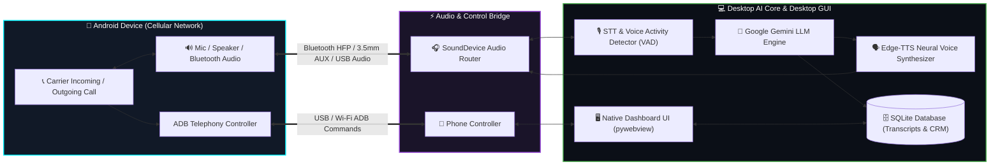

<div align="center">

# 📱⚡ CALLVOX AI
### **Autonomous Real-Time AI Calling Agent for Physical Android Smartphones & Desktop**

*Turn any Android phone with a SIM card into an autonomous, ultra-low-latency AI Voice Agent powered by Google Gemini, Edge-TTS, and ADB.*

[](https://www.python.org/)
[](https://ai.google.dev/)
[](https://github.com/rany2/edge-tts)
[](https://developer.android.com/studio/command-line/adb)
[](LICENSE)
[](#)

<p align="center">
  
</p>

[✨ Key Features](#-key-features) •
[🏗️ Architecture](#-system-architecture) •
[⚡ Quick Start](#-quick-start) •
[🎧 Audio Setup](#-audio-routing-blueprint) •
[🖥️ Desktop GUI](#-desktop-control-center) •
[⚙️ Configuration](#-configuration--env) •
[🤖 AI Personas](#-custom-ai-personas)

---

</div>

## 💡 Why This Project?

Most AI phone calling systems require **costly cloud telephony services** (Twilio, Vonage, Plivo, SIP trunks) with per-minute fees, regulatory caller-ID verification hurdles, and carrier restrictions.

**CallVox AI bypasses all VoIP aggregators entirely.** It bridges your PC directly to an **Android Smartphone** using hardware audio channels and ADB (Android Debug Bridge). Your AI agent answers and places real cellular phone calls directly through your standard mobile SIM plan with zero carrier fees!

```
      ╔══════════════════════════════════════════════════════════════════╗
      ║                     NO TWILIO. NO VOIP FEES.                     ║
      ║       Real SIM Calls • Real Phone Numbers • Sub-second Voice     ║
      ╚══════════════════════════════════════════════════════════════════╝
```

---

## ✨ Key Features

<div align="center">

| Feature | Description | Highlight |
| :--- | :--- | :---: |
| 📞 **Direct Cellular Calls** | Inbound auto-answering and autonomous outbound dialer directly over your Android carrier. | **Zero VoIP Costs** |
| 🧠 **Gemini LLM Brain** | Powered by high-speed Google Gemini models for conversational reasoning and intent analysis. | **Sub-Second Latency** |
| 🗣️ **Ultra-Realistic Neural TTS** | Microsoft Edge Neural Voice synthesis with human-like breathing, cadence, pitch, and speed. | **100+ Natural Voices** |
| 🎛️ **Modern Desktop GUI** | Sleek Cyberpunk/Glassmorphic dashboard with live audio visualizers, call logs, & transcripts. | **Native pywebview App** |
| 🔄 **Live Call Summaries & CRM** | Real-time audio transcription, caller intent classification, and structured SQLite history logs. | **Full CRM Export** |
| 📶 **USB & Wireless ADB** | Works over standard USB-C cable or Wi-Fi 5GHz for seamless wireless untethered calling. | **Flexible Connectivity** |
| 🎙️ **Dual Audio Architecture** | Supports Bluetooth Hands-Free Profile (HFP), 3.5mm TRRS Splitters, or Virtual Audio Cables. | **Zero Echo & Lag** |
| 🎭 **Dynamic AI Personas** | Configurable prompts for customer support, appointment booking, medical reception, or sales outreach. | **Instant Customization** |

</div>

---

## 🏗️ System Architecture



---

## 🎧 Audio Routing Blueprint

To conduct bidirectional phone conversations, audio is bridged between the Android phone and your PC:

```
                  ┌──────────────────────────────────────────────────┐
                  │                 TWO-WAY AUDIO PATH               │
                  └──────────────────────────────────────────────────┘

 [Caller's Voice] ──> [Phone Audio Out] ──> [PC Audio In (STT)] ──> [Gemini LLM]
                                                                          │
 [Caller Hears]   <── [Phone Mic In]    <── [PC Audio Out (TTS)] <────────┘
```

### Supported Setup Options:

| Setup Method | Connection Type | Latency | Complexity | Recommended For |
| :--- | :--- | :--- | :--- | :--- |
| 🔵 **Bluetooth HFP** | Wireless (Hands-Free Profile) | ~120ms | ⭐ Easy | Everyday convenience, completely wireless |
| 🔌 **3.5mm AUX + TRRS Splitter** | Wired analog audio cables | <10ms | ⭐⭐ Medium | Studio quality, zero interference |
| 🎚️ **Virtual Audio Cable** | Software routing (VB-Cable / VoiceMeeter) | ~30ms | ⭐⭐⭐ Advanced | Power users & custom microphone setups |

---

## ⚡ Quick Start

### 📋 Prerequisites
- **Python 3.10+** installed
- **Android Phone** (Android 9.0+) with Developer Options enabled
- **Google Gemini API Key** ([Get free key here](https://aistudio.google.com/))
- **ADB** (Bundled in `scrcpy-win64` or system-wide)

---

### 1️⃣ Clone & Install

```bash
# Clone the repository
git clone https://github.com/YOUR_USERNAME/CallVox-AI.git
cd CallVox-AI

# Create virtual environment
python -m venv venv
# Windows:
.\venv\Scripts\activate
# Linux/macOS:
source venv/bin/activate

# Install dependencies
pip install -r requirements.txt
```

---

### 2️⃣ Configure Environment

Copy the example configuration file:
```bash
# Windows
copy .env.example .env

# Linux / macOS
cp .env.example .env
```

Open `.env` and fill in your **Gemini API Key**:
```env
GEMINI_API_KEY=AIzaSyYourGeminiApiKeyHere
AI_VOICE=en-US-JennyNeural
SYSTEM_PROMPT=You are an expert AI receptionist for Apex Solutions. Be polite, concise, and helpful.
```

---

### 3️⃣ Connect Your Android Device

#### Option A: Standard USB (Easiest)
1. Enable **USB Debugging** in `Settings > Developer Options`.
2. Connect your phone via USB cable and tap **Allow Debugging**.
3. Verify connection:
   ```bash
   python main.py --check-adb
   ```

#### Option B: Wireless Debugging (Android 11+)
```bash
# Pair device (Only once)
python main.py --pair-wireless <PHONE_IP> <PAIR_PORT> <6_DIGIT_CODE>

# Connect wirelessly
python main.py --connect-wireless <PHONE_IP>:5555
```

---

### 4️⃣ Launch the Application

#### 🖥️ Launch Desktop Dashboard (Recommended):
```bash
python app.py
```

#### 💻 Or Run from Command Line:
```bash
# 1. Start Auto-Answer Inbound Call Daemon
python main.py --monitor

# 2. Place an Autonomous Outbound Call
python main.py --outbound "+1234567890"

# 3. View Live Call History & CRM Summaries
python main.py --history

# 4. List Available Audio Devices
python main.py --list-audio
```

---

## 🖥️ Desktop Control Center

The built-in desktop control panel offers full real-time telemetry and control:

```
┌─────────────────────────────────────────────────────────────────────────────┐
│  ⚡ CALLVOX AI  │  Device: [● Pixel 8 Pro - Connected]  │  Status: [IDLE]   │
├─────────────────────────────────────────────────────────────────────────────┤
│                                                                             │
│   [ 📞 DIALER ]           [ 🎙️ AUDIO VISUALIZER ]        [ 📜 LIVE TRANSCRIPT]│
│   ┌─────────────┐        ┌─────────────────────────┐   ┌───────────────────┐│
│   │ +1 (555) 01 │        │   ▂ ▃ ▅ ▆ █ ▇ ▅ ▃ ▂     │   │ Caller: Hello?    ││
│   │ [  CALL  ]  │        │   Sampling Rate: 16kHz  │   │ AI: Hi, how can I ││
│   └─────────────┘        └─────────────────────────┘   │ help you today?   ││
│                                                        └───────────────────┘│
│   [ 📊 RECENT CALLS ]                                                       │
│   • +1-202-555-0199  │  Duration: 02:14  │  Intent: Support Inquiry        │
│   • +1-415-555-0142  │  Duration: 01:05  │  Intent: Appointment Scheduled  │
│                                                                             │
└─────────────────────────────────────────────────────────────────────────────┘
```

- 🎚️ **Live Audio Waveforms**: Visual inspection of voice activity and microphone input gating.
- 📱 **One-Click Dialing**: Type or paste any number to launch an outbound AI conversation.
- 📝 **Live Transcript Stream**: Real-time multi-turn conversation display.
- 🔋 **Battery & Signal Telemetry**: Real-time status sync via ADB.
- 🗃️ **Searchable CRM Database**: Filter, review, replay, and export call records.

---

## ⚙️ Configuration & `.env`

| Key | Description | Default |
| :--- | :--- | :---: |
| `GEMINI_API_KEY` | Google Gemini API Key | *(Required)* |
| `AI_VOICE` | Microsoft Edge TTS voice model identifier | `en-US-JennyNeural` |
| `AI_LANGUAGE` | Default speech recognition and response language | `en-US` |
| `AUDIO_INPUT_DEVICE` | Sound device index/name for Phone Audio Input | `default` |
| `AUDIO_OUTPUT_DEVICE` | Sound device index/name for AI Voice Output | `default` |
| `AUTO_ANSWER_DELAY` | Seconds to wait before answering an incoming call | `2.0` |
| `RECORD_CALLS` | Save high-definition audio recordings of calls | `true` |
| `ADB_MODE` | Connection mode (`USB` or `WIRELESS`) | `USB` |

---

## 🤖 Custom AI Personas

Change your AI's identity instantly by updating `SYSTEM_PROMPT` in `.env` or in the desktop dashboard:

<details>
<summary><b>🏢 Corporate Receptionist & Secretary</b></summary>

```text
You are Sarah, the executive virtual assistant for Nexus Tech. 
Your goal is to warmly welcome callers, inquire about their needs, answer general business questions, and take clear messages or schedule appointments. Keep answers polite, helpful, and concise.
```
</details>

<details>
<summary><b>🏥 Dental / Medical Clinic Scheduler</b></summary>

```text
You are Alex, the appointment receptionist at BrightSmile Dental Clinic.
Help callers schedule, reschedule, or cancel dental checkups. Confirm their full name, preferred date, and contact number. Keep a reassuring, professional tone.
```
</details>

<details>
<summary><b>🍕 Restaurant Order & Reservation Bot</b></summary>

```text
You are Mario, the digital concierge at Bella Italia Bistro.
Take table reservations (asking for party size, date, and time), answer menu and dietary questions, and provide opening hours. Keep answers energetic, concise, and friendly.
```
</details>

---

## 🛠️ Tech Stack

- **Core Runtime**: [Python 3.10+](https://www.python.org/)
- **Large Language Model**: [Google Gemini Pro / Flash](https://ai.google.dev/)
- **Voice Synthesis**: [Edge-TTS](https://github.com/rany2/edge-tts) (Neural Microsoft Voices)
- **Speech Recognition**: [SpeechRecognition / Google STT / Whisper VAD](https://github.com/Uberi/speech_recognition)
- **Audio I/O**: [SoundDevice](https://python-sounddevice.readthedocs.io/), [PyDub](https://github.com/jiaaro/pydub), [NumPy](https://numpy.org/)
- **Hardware Controller**: [Android Debug Bridge (ADB)](https://developer.android.com/tools/adb) & [scrcpy](https://github.com/Genymobile/scrcpy)
- **Desktop UI**: [pywebview](https://pywebview.flowrl.com/), HTML5, Modern Glassmorphism CSS, Vanilla JS
- **Database**: [SQLite3](https://www.sqlite.org/) with automated indexing

---

## 🛡️ Privacy & Compliance Notice

> [!IMPORTANT]
> This software is designed for legitimate automation, personal productivity, customer service, and accessibility use cases. 
> - Call recording and automated telephony laws vary across states and countries (One-Party vs Two-Party Consent).
> - Always ensure you comply with local regulations (such as TCPA in the US, GDPR in the EU, or equivalent local telecommunications acts) and inform callers when calls are recorded or powered by AI.

---

## 🤝 Contributing

Contributions make the open-source community an amazing place to learn, inspire, and create!

1. Fork the Project
2. Create your Feature Branch (`git checkout -b feature/AmazingFeature`)
3. Commit your Changes (`git commit -m 'Add some AmazingFeature'`)
4. Push to the Branch (`git push origin feature/AmazingFeature`)
5. Open a Pull Request

---

## 📄 License

Distributed under the **MIT License**. See `LICENSE` for more information.

---

<div align="center">

Made with ❤️ by AI Enthusiasts • Star ⭐ this repository if you find it helpful!

</div>
